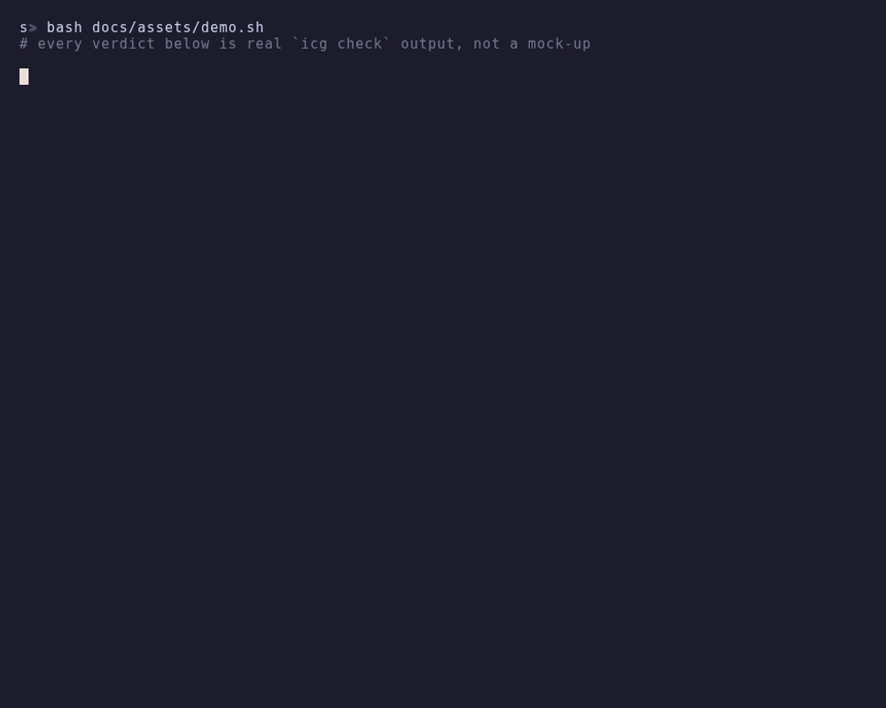
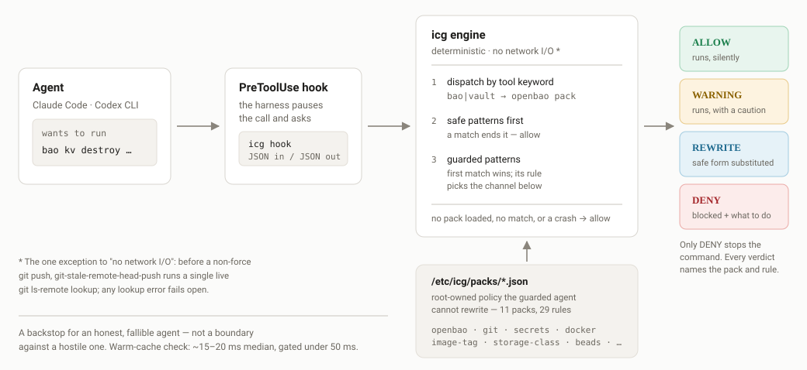

# irreversible-command-gate

**A last-second guard for AI coding agents.** It sits in the harness's
`PreToolUse` hook, reads the command or file the agent is about to act on,
and stops the handful that cannot be undone — destroying a secret,
force-pushing over history, printing a credential into the transcript,
purging a volume — while everything else passes through untouched.

Every denial says what to do instead. That is the point: the agent should
finish the turn knowing the sanctioned path, not just that it was blocked.

<p align="center">
  
</p>

<sub>Real `icg check` output — all four verdicts, and both input modes
(a shell command, and file content as `Write`/`Edit`/`apply_patch` would
supply it). Reproduce it with [`docs/assets/demo.sh`](docs/assets/demo.sh).</sub>

## How it works

<p align="center">
  
</p>

<p align="center">
  
</p>

<sub>The same evaluation, step by step. Reproduce the trace with
<code>icg check --command "bao kv destroy secret/app/db" --debug</code>.</sub>

Two things decide everything: **safe patterns are tried first and
short-circuit**, and among guarded patterns **the first match wins**. That
ordering is what keeps ordinary read-only work quiet — a rule only ever fires
on input no safe pattern claimed.

Four verdicts, one per redirect channel a rule can declare — and **only
`deny` stops the command**:

| Verdict | Hook response | When |
| --- | --- | --- |
| `ALLOW` | `permissionDecision: allow` | No rule matched, or a safe pattern matched first |
| `WARNING` | `allow` + `additionalContext` | The rule cannot decide reliably enough to block, but the agent should know |
| `REWRITE` | `allow` + `updatedInput` | A safe form of the same intent exists — the harness retries with it |
| `DENY` | `permissionDecision: deny` | Irreversible; the reason carries the alternative |

The engine is deterministic and does no network I/O. It **fails open**: an
empty pack directory, an unrecognised tool, or a crashed check allows the
command. A missed violation is recoverable; a wedged agent fleet is not.
A graduated [fail-closed policy](docs/operators/fail-closed-mode.md) exists
for once a release has proven itself.

Median cost of a check on a warm cache: **~10 ms**.

## Try it in a minute

Grab the release binary — or build from source, which needs nothing but a
Rust toolchain:

```bash
curl -fsSLO https://github.com/jedarden/irreversible-command-gate/releases/download/v0.1.54/icg
chmod +x icg

# or:  git clone https://git.ardenone.com/jedarden/irreversible-command-gate.git
#      cd irreversible-command-gate && cargo build --release && cd target/release

./icg coverage --list
./icg check --command "bao kv destroy secret/app/db"
./icg check --command "git push --force origin main"
./icg check --command "git status"
```

Run it from a checkout and it picks up `packs/` automatically; run the bare
binary and pass `--pack <dir>` or install the packs (below).

`icg check` is the human-facing tester and always exits `0` — parse its
output, not its status. `icg hook` is the machine entry point: one
PreToolUse JSON document in, one decision envelope out.

To actually guard an agent, install the binary and packs root-owned and
register the hook. `install.sh` does all of it and **proves the result
enforces before reporting success**:

```bash
curl -fsSL https://raw.githubusercontent.com/jedarden/irreversible-command-gate/main/install.sh \
  | sudo bash -s -- --hook
```

That last part matters more than it sounds. `icg hook` fails open by design:
with no readable pack directory it answers `{"permissionDecision":"allow"}`
and exits 0, silently. A half-finished install therefore looks exactly like a
working one. The installer sends a known-destructive command through the hook
and refuses to report success unless it comes back denied — so you cannot end
up believing you are guarded by nothing.

`--dry-run` shows what it would do; `--uninstall` reverses it. The manual
steps are in the **[Quick Start Guide](docs/quick-start.md)**.

## What ships today

Ten rule packs, 26 guarded patterns, 18 safe patterns that keep common
read-only forms fast and quiet.

| Pack | Rules | Blocks |
| --- | --- | --- |
| `openbao` | 3 | `kv destroy`, `metadata delete`, mount/policy deletion, `operator rekey`; secret literals in argv; secret reads to stdout |
| `git` | 4 | bare `git credential fill`; `--force` push (rewritten to a plain push); commits with no pathspec; pushing over a stale remote head |
| `secrets` | 6 | GitHub tokens and PATs, AWS keys, Slack tokens, Anthropic keys, PEM private-key blocks — in commands *and* file content |
| `docker` | 3 | `system prune --all`, `volume rm`, `image rm --force` |
| `image-tag` | 2 | `:latest` and bare-SHA image references in manifests |
| `storage-class` | 1 | storage classes that cannot be expanded or reclassed in place |
| `beads` · `misc` · `tmux` · `argocd-topology` | 7 | conventions of the fleet this was built for — useful mainly as worked examples |

The first four packs describe footguns that exist wherever the tool does.
The last row encodes local convention. The
[coverage table](docs/quick-start.md#what-gets-protected) marks every pack
*General* or *Fleet-specific* and names every rule id, so you can tell at a
glance which ones travel.

Nothing about the engine is fleet-specific — `icg new-pack <tool>`
scaffolds a pack and its regression test together.

## What this deliberately does not do

- **It is a backstop for an honest, fallible agent, not a boundary against
  a hostile one.** Policy lives root-owned in `/etc/icg/` so the guarded
  agent cannot rewrite it, but an agent that sets out to defeat the guard
  can. Keep the harness's own approval and sandbox controls on.
- **It does not defend against prompt injection** or a malicious repository
  trying to trick an honest agent. Different threat class, explicitly out of
  scope.
- **It does not know who is calling.** There is no identity, TTY or privilege
  check anywhere in the engine. Rules whose text says "a human runs it"
  describe a procedure you follow, not a capability the guard enforces. The
  agent/human split you get from hook mode is structural — `icg hook` only
  runs inside the harness's tool loop — and the PATH wrapper has no such
  split unless you scope its symlinks to the agent's `PATH`
  ([deployment guide](docs/operators/deployment-guide.md#scoping-the-wrapper-to-the-agent)).
  `ICG_DISABLED=1` is audited, not restricted: an agent can set it as easily
  as you can.
- **It does not reach cloud-hosted agent sessions** — ChatGPT web, Codex
  cloud tasks, claude.ai. Only local CLIs invoke local hooks. See
  [multi-harness-integration.md](docs/notes/multi-harness-integration.md).
- **It does not cover `kubectl` mutations.** Those stay with the org-level
  Python hook by decision, not by omission —
  [existing-enforcement-infrastructure.md](docs/notes/existing-enforcement-infrastructure.md).
  `.github/workflows/*` writes and `kind: Job`/`CronJob` manifest content,
  by contrast, *are* covered: built-in guards deny them on Write/Edit and
  Codex `apply_patch` —
  [github-workflows-detection-seam.md](docs/notes/github-workflows-detection-seam.md)
  — redundantly with the org-level hook for as long as both run.

## Project status

The engine, the packs, both front-ends (hook and PATH wrapper), the
release-integrity machinery, and 526 passing tests across 52 files are in
the tree and working. The whole crate is 25,800 lines of Rust with 17
dependencies and no C toolchain requirement.

**`v0.1.4` is the current release** (2026-09-08). It is the first release
cut by the version auto-bump in `icg-ci`: before it, a push that did not
touch `Cargo.toml` produced a green run that shipped nothing, and five fixes
accumulated behind the published `v0.1.3`. Those fixes are what this release
carries — `icg status --denials` reads the log the hook actually writes;
`cargo test` on an instrumented host no longer appends to the live denial
log; `beads-shared-checkout-write` guards the bead store rather than every
scratch file under `.beads/`; the hook no longer demands a write lock on
root-owned policy state on every call; and a healthy guarded invocation now
leaves stderr empty for real faults.

`v0.1.3` (2026-09-06) remains the release to upgrade from if you are on
`v0.1.1` or `v0.1.2`: it closed a guard bypass where an apostrophe in a
heredoc body made the lexer lose the rest of the command, silently skipping
six of ten command-mode packs including all the Critical destructive rules.

Each release carries the binary, the pack tarball, a byte-level pack
manifest, and the merged `rule-pack.json`. Several releases now exist, so
`icg update`'s trust-pointer flow has real predecessors to advance from — but
that transition has still not been exercised end to end. Treat `icg update`
as unproven until it has. Tracked in
[`docs/plan/plan.md`](docs/plan/plan.md), Phase 0.

## Documentation

Start at **[docs/README.md](docs/README.md)** for the full map. The short
version:

| You are | Read |
| --- | --- |
| Trying it out | [Quick Start](docs/quick-start.md) |
| Deploying it | [Deployment guide](docs/operators/deployment-guide.md) → [Operator docs](docs/operators/README.md) |
| Hit a denial | [Deny-message guide](docs/operators/deny-messages.md) |
| Writing a rule pack | [Rule-pack best practices](docs/developers/rule-pack-best-practices.md) |
| An agent working in this repo | [AGENTS.md](AGENTS.md) |
| Curious about the design | [plan.md](docs/plan/plan.md) · [ideas ledger](docs/notes/ideas-ledger.md) |

## Authoring a rule pack

```bash
icg new-pack <tool> --pack-type command --output-dir packs/
```

Writes `<tool>.json` and `<tool>_pack_tests.rs` together, pre-filled, and
refuses to overwrite either. `--pack-type content` scaffolds a file-content
pack instead.

Before proposing a pack change, run the release gate — it builds the fixed
deny-regression corpus and reports any rule that stopped covering what it
used to:

```bash
icg regression-suite packs --release-gate --output regression-suite.json
icg coverage-diff <previous-pack> <current-pack>
```

Per-pack generation (`icg regression-suite packs/<id>.json`) works on every
shipped pack. Rules a *deny* suite cannot represent — a rewrite or warning
channel, a predicate needing live state, the `secrets` pack's unconditional
matching — are reported in the suite's `skipped` array with the reason,
rather than aborting the pack. A deny rule with a regex check is never
skipped: if its command cannot be derived from the regex, give it an
`example_command` in the pack.

## License

MIT — see [LICENSE](LICENSE).

---

Part of [jedarden.com](https://jedarden.com).

*The GitHub repo is a read-only mirror of
`git.ardenone.com/jedarden/irreversible-command-gate` — issues and PRs are
welcome on either.*
