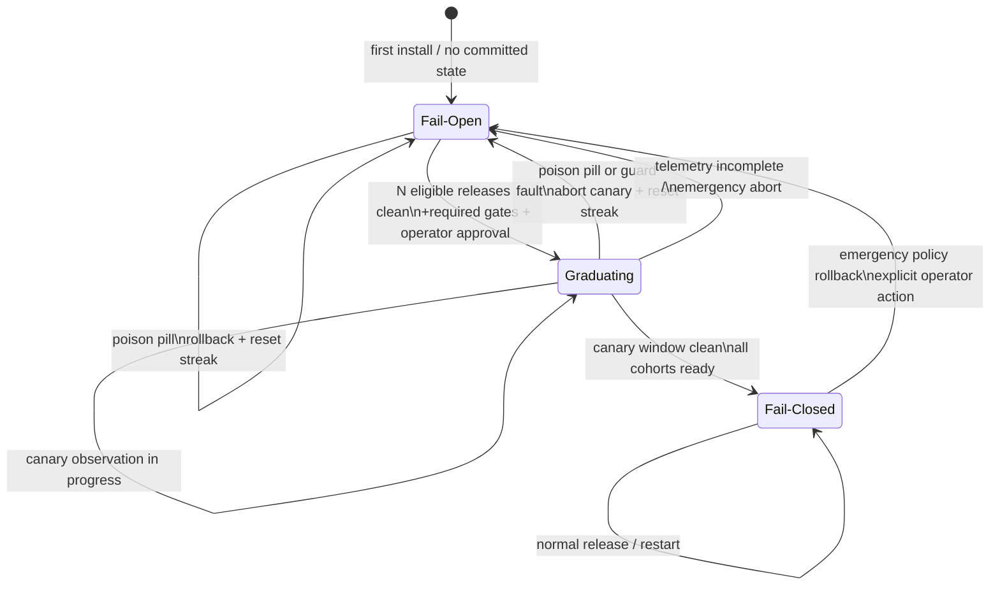

# Fail-Closed Transition State Machine

Status: design for `irrevers-aab3854c`
Scope: the guard's response to guard-availability failures (process exit,
OOM-kill, timeout, or missing/invalid hook response)

## Purpose and boundaries

The current `org-rule-guard.py` policy is fail-open: a guard error must not
turn a fleet-wide safety hook into a fleet-wide workflow outage. This design
preserves that default while defining how a proven deployment can graduate to
fail-closed behavior.

The state machine governs the *availability* of the guard, not the result of
an individual rule. A malformed input, invalid rule regex, or exception while
evaluating one invocation remains fail-open and is reported as an internal
error. It must not be silently reclassified as a poison-pill event. The
graduated policy applies when the harness cannot obtain a trustworthy guard
decision at all: the process dies, exits unsuccessfully, times out, or emits
an unusable response.

Fail-closed also requires an enforcement point that can observe those failures.
For the hook adapters this is the harness's configured "deny on hook error or
timeout" behavior. For a PATH wrapper it is the wrapper/supervisor contract
for an unavailable guard. Setting an environment variable inside a process
cannot by itself detect that the process was OOM-killed. Until each deployed
front-end has such an enforcement point, it is not eligible for the
Fail-Closed state.

## State machine

The policy state is fleet-level, with a deliberate canary split while in
`Graduating`. Individual hosts persist and report the same state generation;
they do not independently decide that the fleet has graduated.



There is no automatic `Fail-Closed → Fail-Open` transition merely because a
release caused a deny-rate spike. That is the poison-pill mechanism's release
rollback path, not a policy rollback. The guard remains fail-closed after the
bad release is reverted. Lowering the crash policy is an explicit emergency
action because it reduces protection.

## States and fleet behavior

### Fail-Open

This is the bootstrap and compatibility state.

- A normal, successfully evaluated request receives the normal allow, deny,
  warning, or rewrite result.
- A guard-availability failure allows the operation to proceed, emits a
  high-priority health event, and increments crash/fault telemetry.
- All cohorts and front-ends remain fail-open. The still-deployed
  `org-rule-guard.py` remains unchanged and fail-open as well.
- A poison-pill trigger rolls the trust pointer back to the previous release
  through the existing mechanism and resets the clean-release streak to zero.

Fail-open does not mean silent. The availability failure is observable and
must be recorded even though the operation is allowed.

### Graduating

This is a controlled canary state, not an abbreviated name for fail-closed.
The transition record identifies a canary cohort, a candidate release, and an
observation window.

- The canary cohort uses fail-closed handling for guard-availability failures.
  A dead or timed-out guard therefore denies work in that cohort.
- The remainder of the fleet continues to use fail-open handling.
- Normal rule results are identical in both cohorts; the state only changes
  what happens when there is no trustworthy result.
- Telemetry and health events from every cohort are considered when deciding
  whether the candidate is safe to promote.
- Any guard fault in the canary, or any fault that invalidates the fleet-wide
  reliability evidence, aborts graduation and returns the fleet to
  Fail-Open. The streak is reset.
- A poison-pill trigger uses the existing automatic trust-pointer rollback,
  aborts the canary, and returns to Fail-Open. The triggering release cannot
  count as clean.

The canary size, observation duration, and required acknowledgements are
implementation configuration. They must be recorded in the transition state
so a controller restart cannot accidentally shorten the canary.

### Fail-Closed

This is the graduated state for a front-end that has passed the canary.

- A normal successful invocation retains the normal rule decision.
- A process exit, OOM-kill, timeout, missing response, or invalid response is
  denied by the harness/wrapper boundary. The denial identifies the guard
  availability failure and the active state generation.
- A caught individual evaluation error remains subject to the existing
  fail-open rule described above; it is logged and counted as a health event.
- A poison-pill trigger rolls back the bad *release* and records the trigger,
  but does not lower the crash policy. The fleet remains Fail-Closed while the
  previous trusted release is restored.
- Restarting a healthy guard does not reset the policy. The next invocation
  loads the committed Fail-Closed state and resumes normal operation.

If a front-end cannot enforce denial when its guard is unavailable, it must
not advertise itself as Fail-Closed. The fleet controller either keeps that
front-end in Fail-Open or blocks the graduation until the harness contract is
fixed.

## Graduation criteria

Let `N` be a configured, positive integer selected when the graduation
implementation is built. The exact threshold is intentionally **TBD at
implementation time**; it must not be hard-coded into this design document.
Changing `N`, the observation-window definition, or the poison-pill detector's
configuration invalidates the current streak and requires requalification.

The primary graduation criterion is **N consecutive uniquely identified
releases with zero poison-pill triggers**. The additional checks below ensure
that "zero" means a fully observed, armed detector rather than missing data.

A release is an eligible clean release only when all of the following hold:

1. It is a new, uniquely identified trusted release (tag or immutable commit
   reference), and its adoption is recorded by the trust-pointer mechanism.
2. Its configured observation window completed for the required fleet/cohort
   population. Missing, corrupt, or partial telemetry is **unknown**, not
   zero.
3. The poison-pill detector was enabled and armed for that window.
4. The detector emitted no poison-pill trigger for that release. Ordinary
   policy denials do not count as poison-pill triggers; the trigger is the
   conservative deny-rate anomaly that causes automatic release rollback.
5. The release passed the existing release-integrity and regression gates.
6. No guard-availability fault occurred during the reliability observation
   used for graduation. This is separate evidence from the poison-pill
   signal and prevents a crash-free deny-rate window from being mistaken for
   guard reliability.

The controller maintains a consecutive streak of eligible clean releases:

```text
clean_streak := 0

on unique eligible release with no poison pill and no availability fault:
    clean_streak := clean_streak + 1

on poison-pill trigger, availability fault, or invalidated release evidence:
    clean_streak := 0
```

When `clean_streak >= N`, the controller may enter `Graduating` after the
remaining operational gates pass: an enforcement point exists for every
canaried front-end, telemetry is writable/readable, and an authorized
operator approves the canary. Reaching `N` is therefore the objective release
health criterion; it does not bypass the canary or permit an unsafe automatic
fleet-wide switch.

The canary promotes to `Fail-Closed` only after its complete observation
window has no guard-availability fault, no poison-pill trigger, and no
telemetry gap, and every required cohort reports the committed state
generation. A manual "force graduate" operation must not bypass `N`; an
emergency demotion is allowed and is described below.

## Transition triggers and actions

| Event | Fail-Open | Graduating | Fail-Closed |
| --- | --- | --- | --- |
| Normal successful check | Keep state; record result | Record result by cohort | Record result |
| Guard process fault | Allow, alert, reset streak | Deny canary; abort to Fail-Open | Deny affected invocation; page operator |
| Poison-pill trigger | Auto-rollback release; reset streak | Auto-rollback; abort to Fail-Open; reset streak | Auto-rollback release; remain Fail-Closed |
| Complete clean release | Increment streak | Continue canary evidence | Remain Fail-Closed |
| Missing/invalid telemetry | Do not increment; alert | Abort or hold; do not promote | Alert; do not weaken policy |
| Emergency demotion | Remain Fail-Open | Abort to Fail-Open | Explicitly write Fail-Open emergency state |
| Restart after ordinary crash | Load Fail-Open state | Resume committed canary state | Load Fail-Closed state |

The controller must process a poison-pill event before counting the affected
release as clean. If the release was already counted because of a race, the
event is a compensating reset and the audit log records the correction.

## Integration with poison-pill tracking

The existing poison-pill work is the release-health source for this state
machine. This is the tracking mechanism referred to as `icg-2ck` in the
graduation requirement (currently split between per-release measurement and
rollback reaction in this repository). The state machine must not invent a
second deny-rate signal or modify the poison-pill detector's thresholds.

Current integration points are:

- `TelemetryStore` records evaluations with `EvaluationRecord.release_ref`.
  The graduation controller consumes per-release completion and trigger data,
  not a global deny count with no release identity.
- The poison-pill detector's typed `DenyRateDeviation` is the trigger input,
  and `rollback::check_and_rollback` returns typed rollback evidence. The
  graduation controller must not parse human-readable log lines.
- `rollback::check_and_rollback` / the trust-pointer store remains responsible for
  reverting a bad release. The controller observes the result and records the
  policy consequence: reset the clean streak in Fail-Open or Graduating;
  preserve Fail-Closed after a release rollback.
- `TrustPointerState.previous_trusted_ref` and rollback metadata provide the
  link needed to verify that the event rolled back the release that was under
  observation. A failed or cooldown-suppressed rollback is not a clean
  release and must page an operator.
- The telemetry and poison-pill stores remain authoritative for their own
  data. Graduation reads them through an API/query seam; it does not rewrite,
  clear, or acknowledge events by mutating the poison-pill store.

The poison-pill mechanism and graduation controller therefore have distinct
responsibilities:

```text
per-invocation result
        ↓
release-bound telemetry → poison-pill anomaly → trust-pointer rollback
        │                                          │
        └──────────── graduation observer ←────────┘
                         ↓
                 clean-release streak
```

A single ordinary `Denied` result is not a poison pill. Conversely, a
poison-pill event is not evidence that the guard itself crashed. Keeping those
signals separate prevents a bad rule pack from silently graduating the crash
policy and prevents a normal destructive-command denial from resetting useful
release evidence.

## Durable state and crash recovery

The policy state is separate from the rolling evaluation window and from the
trust pointer, although it stores references to both. It should be persisted
in an administrator-controlled, durable location; a user-writable cache or an
environment variable is not an authority for Fail-Closed mode.

The minimum persisted record is:

```text
PolicyState {
    schema_version
    generation                 # monotonically increasing state version
    state                      # FailOpen | Graduating | FailClosed
    threshold_n
    clean_release_streak
    active_release_ref
    canary_cohort and canary_deadline (when Graduating)
    last_poison_pill_event_ref
    last_transition { time, actor, reason }
    emergency_override { incident, expires_at } (when demoted)
}
```

Persistence requirements:

1. Write the new state to a temporary file, flush it, atomically replace the
   committed snapshot, and sync the parent directory. This matches the
   existing state-store durability model.
2. Persist `Graduating` before changing the canary's runtime configuration.
   Persist `Fail-Closed` only after the canary result and required cohort
   acknowledgements are durable.
3. Include the generation in every runtime decision and health report. A host
   with an older generation must not be treated as graduated.
4. Keep a last-known-good snapshot or journal entry so a torn/corrupt current
   file can be recovered without guessing the policy.
5. Make policy writes privileged or otherwise authenticated. The guarded agent
   must not be able to edit its own state from Fail-Closed to Fail-Open.

Recovery after a controller or guard crash is deterministic:

| Point of failure | Recovery behavior |
| --- | --- |
| Before the `Graduating` record is committed | Remain Fail-Open; no canary was authorized |
| After `Graduating` is committed, before canary rollout completes | Resume the recorded canary generation; hold promotion until its original window is revalidated |
| During canary observation | Keep canary Fail-Closed and the remainder Fail-Open; abort to Fail-Open if the observation cannot be proven complete |
| After `Fail-Closed` is committed | Resume Fail-Closed; a guard-availability failure denies until the guard/harness recovers |
| After poison-pill rollback but before policy update | Reconcile from the poison-pill event and trust pointer; apply the reset idempotently using the event identity |
| No valid state on first install | Bootstrap Fail-Open and emit a configuration alert |
| State unreadable after a prior Fail-Closed commitment | Use the authenticated last-known-good/backup record; if it says Fail-Closed, deny rather than guess. If no authenticated history exists, do not claim Fail-Closed and require operator reconciliation before promotion |

State transitions are idempotent by `(generation, event_id)`. A retry after a
crash must not increment the clean streak twice, roll back the same release
twice, or promote a canary from an incomplete observation.

## Emergency rollback from Fail-Closed

Policy rollback is an out-of-band, operator-authenticated control path. It
must remain usable when the normal hook path is denying every operation.

1. The operator records the incident and writes a new, higher-generation
   `Fail-Open` state with the reason, actor, time, and optional expiry. The
   operation is not performed through the guarded agent session.
2. The deployment mechanism propagates that generation and the harness/wrapper
   fail-open setting to every cohort. Hosts acknowledge the generation; mixed
   generations are visible and alerting remains active until convergence.
3. The controller resets `clean_release_streak` to zero. The emergency
   demotion never qualifies the fleet for automatic re-promotion.
4. Operators investigate the crash, rule-pack release, or harness fault. A
   subsequent return to `Graduating` requires `N` new clean releases and a
   fresh canary.

An emergency override may be time-bounded, but expiry returns to the prior
committed policy (normally Fail-Closed) rather than silently granting a
permanent fail-open exception. Poison-pill release rollback should be used for
bad rule packs; emergency policy rollback is reserved for a guard or harness
incident, fleet recovery, or an explicitly accepted operational emergency.

## Implementation handoff

The implementation following this design should provide tests for:

- streak increment, reset, duplicate-release suppression, and configurable
  `N`;
- poison-pill consumption without mutation of poison-pill history;
- Fail-Open, canary Fail-Closed, and fleet Fail-Closed behavior for process
  exit, timeout, malformed response, and ordinary rule errors;
- atomic transition recovery at every persistence boundary;
- idempotent reconciliation after a crash and after a repeated poison-pill
  event; and
- explicit Fail-Closed → Fail-Open emergency demotion followed by mandatory
  requalification.

This design does not change `org-rule-guard.py`, choose the final value of
`N`, or select a dedicated watchdog. Those are implementation/deployment
decisions; the fail-closed state cannot be declared complete until every
front-end has a proven way to deny on guard disappearance.
